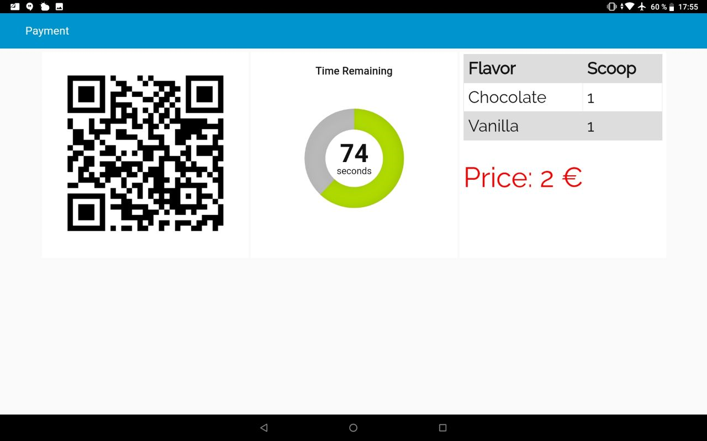

# Payment System of Luigi
Luigi Payment System is a sub-module of Luigi project. It accepts coins and PayPal for payment. This repository includes the payment server, a mock client and Node-RED dashboard for interaction with customer.

## Table of Contents
<!--ts-->
   * [Requirements](#Requirements)
	   * [Hardware Requirements](#Hardware-Requirements)
	   * [Software Requirements](#Software-Requirements)
   * [Installation & Hardware Setup](#Installation--Hardware-Setup)
   * [Usage](#Usage)
   * [Detailed Information](#Detailed-Information)
	   * [Flowchart](#Flowchart)
	   * [Payment Server](#Payment-Server)
	   * [Mock Client](#Mock-Client)
	   * [Node-RED Dashboard](#Node-RED-Dashboard)
   * [Screenshots](#Screenshots)
<!--te-->

## Requirements
The system requires both software and hardware elements. The payment system runs on Raspberry Pi and counts coins via a coin counter and communicates with other Luigi modules via ROS.

### Hardware Requirements
* Raspberry Pi 3B
* CH-926 Multi Coin Acceptor

### Software Requirements
* [ROS Melodic](http://wiki.ros.org/melodic)
* [Roboy Communication](https://github.com/Roboy/roboy_communication)
* Python packages
	* To install required python packages please run `pip install -r requirements.txt`

## Installation & Hardware Setup
1. Clone or download luigi_payment repository `git clone https://github.com/Roboy/luigi_payment.git`
2. Make sure that everything is connected according to circuit scheme, see below.
3. Edit `luigi_payment/src/server.py` accordingly (See [Payment Server](#Payment-Server)).
4. Change `httpStatic` to local luigi_payment copy (See [Node-RED Dashboard](#Node-RED-Dashboard)) to show image in user interface.
5. Import `luigi_payment/node-red-payment-ui/flows.json` and deploy it (See [Node-RED Dashboard](#Node-RED-Dashboard)).


> For very detailed information about how to setup please visit [How to Set-up and Start Payment System page](https://devanthro.atlassian.net/wiki/spaces/SS19/pages/534249648/How+to+Set-up+and+Start+Payment+System).

## Usage
1. Start ROS `roscore`
2. Start Node-RED `node-red`
3. Start payment service `python luigi_payment/src/server.py`

After these steps payment service should be up and running. Type `rosservice list` and search for `payment_server`.

> You can see Node-RED interface from any device that is connected to the same network which Raspberry Pi is connected to.
> Open a browser and go to `RASPBERRY_PI_IP:1880/ui`.

## Detailed Information
In this section, you can find explanations of the scripts and other files.

### Flowchart


### Payment Server
`luigi_payment/src/server.py` handles two payment methods which are coins and PayPal and it supports English and German for PayPal payments.
In order to run it, start `roscore`, `node-red` and then start `server.py` via `python luigi_payment/src/server.py`

* The scripts expect `credentials.txt` file on the same folder which is `luigi_payment/src`.
	* 1st line should be e-mail address.
	* 2nd line should be your e-mail password.
* You can change the following lines in `luigi_payment/src/server.py` to fit your needs.

```python
MAX_COIN_WAIT_TIME = 60 # in seconds
MAX_PAYPAL_WAIT_TIME = 120 # in secons
INPUT_PIN = 3 # Raspberry Pi GPIO pin to read coin counter output.
EXTRA_WAITING_TIME = 10 # in seconds
PRICE_CHECK_INTERVAL = 1 # in seconds
PAYPAL_ME_URL = 'https://www.paypal.me/roboyicecream/'
PAYPAL_LANGUAGE = 'DE' # DE or EN
```

> PayPal URL should be paypal.me URL.

### Mock Client
`luigi_payment/src/client.py` is going to mock Luigi's payment service call indefinitely with changing payment options.

### Node-RED Dashboard
Payment interface can be shown from any device that is connected to the same network which Raspberry Pi is connected to.
You need to start Node-RED via `node-red` and get device's IP to show it on other devices such as tablet.
> Don't forget to import `flows.json` which is under `luigi_payment/node-red-payment-ui` and deploy it after browsing to `127.0.0.1:1880`.
> If there are other flows deployed on your system, consider deleting them.
> You can access the dashboard from any device on the same network by browing `SERVER_IP:1880/ui`.

To show image on tablet please change `httpStatic` to point `luigi_payment/images` folder. The file should be located in `/home/pi/.node-red/settings.js` file.
E.g. `httpStatic: 'LOCAL_PATH/luigi_payment/images/',`

> There must be comma at the end.

### Screenshots

|             Default View            	|            Coin Method           	| PayPal Method                      	|
|:-----------------------------------:	|:--------------------------------:	|------------------------------------	|
|  	|  	|  	|